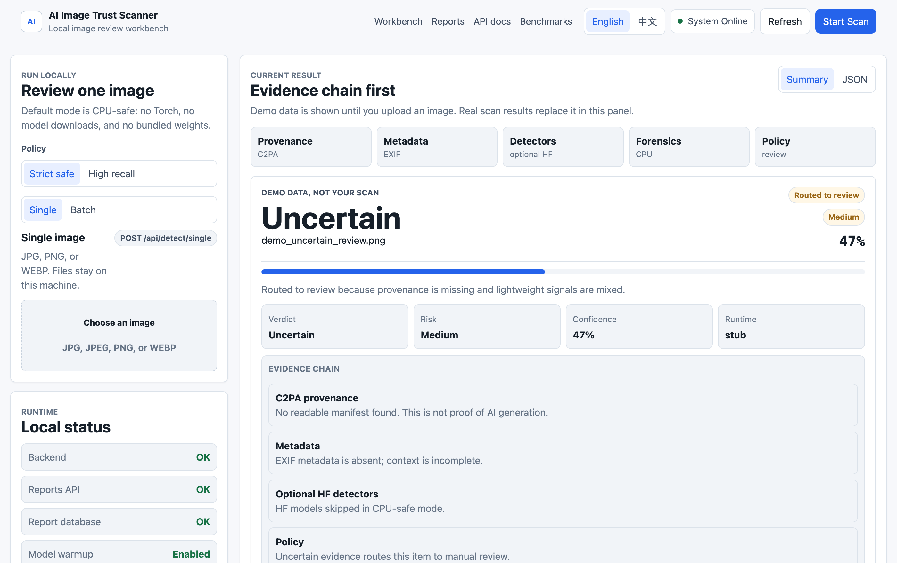

# AI Image Trust Scanner

**A local, transparent evidence-chain workbench for reviewing whether an image may be AI-generated, edited, or provenance-backed.** It combines C2PA provenance, EXIF/metadata, forensic heuristics, optional model detectors, policy rules, and human review into auditable reports — running entirely on your machine.

<!-- Badges: enable after first public push -->


> **Local AI image trust review with evidence, not vibes.**

> ⚠️ **Detection results are risk signals, not legal or forensic conclusions.** Absence of AI evidence does not prove authenticity. Presence of suspicious evidence should trigger review, not automatic enforcement.



*Local dashboard with an auditable evidence chain per image. Default CPU-safe mode runs without Torch or model downloads; the shot above uses labeled demo data.*

---

## Why this exists

Most "AI image detectors" hand you a single confidence score and ask you to trust it. Real trust decisions need more than one number. This tool treats a verdict as a **chain of evidence** you can inspect:

- **Provenance** — C2PA manifests when present
- **Metadata** — EXIF and file-level signals
- **Forensics** — lightweight frequency/artifact heuristics that run on CPU
- **Model detectors** — optional Hugging Face image-classification models
- **Policy** — configurable thresholds and review-routing profiles
- **Human review** — a review queue, report center, and exportable reports

The honest pitch: **not a magic truth machine — a local evidence-chain scanner for AI-image trust review.**

## What it does

- Runs a local **FastAPI** service with a browser **dashboard** (no cloud, no account).
- Scans a single image or a batch.
- Shows **evidence cards**, a model/runtime status panel, and degraded-mode warnings.
- Persists results to a local **SQLite** report store with review status.
- Exports reports as **JSON / CSV / HTML**.
- Ships a **CPU-safe default** that needs no Torch, no downloads, no GPU.

## What it is not

- Not a public SaaS, hosted API, or marketing site.
- Not a claim of legal or forensic certainty.
- Not a project that trained or owns the underlying detector models — it orchestrates and discloses them (see [Detector sources](#detector-sources)).
- Not a bundler of large datasets or private model weights.

## Quickstart

```bash
git clone https://github.com/DEOWL-kan/ai-image-trust-scanner.git
cd ai-image-trust-scanner
python -m venv .venv
source .venv/bin/activate
pip install -r requirements.txt
python scripts/run_local_dashboard.py
```

You'll see:

```text
Dashboard: http://127.0.0.1:8000/dashboard-ui/index.html
API docs:  http://127.0.0.1:8000/docs
Mode:      lightweight / CPU-safe
```

Check your environment any time:

```bash
python scripts/doctor.py
```

Full walkthrough: [docs/QUICKSTART.md](docs/QUICKSTART.md).

## Runtime modes

The scanner is honest about what actually runs.

| Mode | Command | What runs |
| --- | --- | --- |
| **CPU-safe default** (`stub`) | `python scripts/run_local_dashboard.py` | Lightweight baseline + C2PA provenance + EXIF metadata + forensic heuristics + policy + review. **No Torch, no downloads.** Hugging Face detectors are reported as *skipped*. |
| **Optional local model** (`local_hf`) | `pip install -r requirements-open-source.txt`<br>`python scripts/run_local_dashboard.py --with-models` | Additionally loads local Hugging Face image detectors and any optional PEFT/LoRA adapter you configure. |

If optional model packages are missing, the launcher prints a clear error and exits without crashing — the dashboard also degrades gracefully rather than failing.

## Detector sources

The default CPU-safe path does **not** load the deep models below — it uses the lightweight baseline plus provenance/metadata/forensic evidence. The following are named in `configs/detectors.yaml` and only load in optional `local_hf` mode:

| detector_id | Role | Source model | Default (`stub`) |
| --- | --- | --- | --- |
| `smogy` | primary | `Smogy/SMOGY-Ai-images-detector` | skipped |
| `ateeqq` | secondary | `Ateeqq/ai-vs-human-image-detector` | skipped |
| `legacy` | baseline | `lightweight-baseline.no-pretrained` | **active** |
| `dima806` | diagnostic | `dima806/ai_vs_real_image_detection` | disabled unless enabled |

An optional Smogy PEFT/LoRA adapter (`ft_smogy_lora_v2`) is **not shipped in v1** pending license review of the base model and training data. See [docs/MODEL_REPRODUCIBILITY.md](docs/MODEL_REPRODUCIBILITY.md) and [models/ft_smogy_lora_v2/MODEL_CARD.md](models/ft_smogy_lora_v2/MODEL_CARD.md).

> UI copy may refer to the "Minerva visual engine" as product branding, but the underlying detector models and sources are disclosed here and in the docs.

## Accuracy

This is an evidence-chain scanner, not a single-score detector. It emits `real`, `ai`, or `uncertain` (routed to review), so two figures matter: **strict accuracy** (counts every `uncertain` as wrong, ~69–76% on hard sets) and **decided accuracy** (only confidently-labeled images, ~93–95% because ambiguous cases go to review).

> In clear decisions, roughly **94–95% accuracy** on current local API sample tests, with low real-image false positives; ambiguous cases are routed to review. This is **not** a claim of 95% universal AI-image-detection accuracy.

The honest catch: **the strong numbers require the optional models, which are not all bundled.**

| Tier | Ships in v1 | Representative result |
| --- | --- | --- |
| **Default CPU-safe** (lightweight baseline) | ✅ | Near-chance as a standalone classifier — value is provenance/metadata/forensic evidence + review, not accuracy |
| **Optional base HF model** (`Smogy`, you download it) | ⚙️ opt-in | Mirage-Test n=500: **88.4% acc, 0.921 AUROC** |
| **Optional LoRA adapter** (`ft_smogy_lora_v2`) | ❌ not shipped | Defactify n=400: 76% strict / ~95% decided, 1.0% real FP — *not reproducible from this repo* |

Numbers are on modest samples against unpinned model revisions. Full methodology, per-dataset tables, and limitations: **[docs/BENCHMARKS.md](docs/BENCHMARKS.md)**.

## Architecture

```text
app/
  main.py          FastAPI entry, routes, static dashboard mount
  pipeline/        lightweight detection engine (forensics, frequency,
                   metadata, model detector, fusion, decision policy)
  adapters/        API/output-schema adapters
  detectors/       detector registry, HF runtime, C2PA provenance
  policy/          evidence policy application
  services/        report store, review, batch, retention, readiness, ...
frontend/dashboard/  local GUI (native HTML/CSS/JS, no framework)
configs/           detector, policy, and review-routing configuration
scripts/           run_local_dashboard.py, doctor.py, supported CLIs
docs/              quickstart, reproducibility, architecture, manifests
examples/          tiny sample payloads and fixtures
```

## API examples

```bash
# Health
curl http://127.0.0.1:8000/health

# Single-image scan
curl -F "file=@path/to/image.png" \
  "http://127.0.0.1:8000/api/detect/single?policy_profile=default"

# Recent reports
curl "http://127.0.0.1:8000/api/v1/reports?limit=20"
```

Interactive API docs are served at `/docs`. The dashboard endpoints are listed in [`frontend/dashboard/README.md`](frontend/dashboard/README.md).

## Development

```bash
make install     # create venv and install default requirements
make run         # start the local dashboard
make test        # run the default lightweight test suite
make doctor      # environment self-check
```

Tests run without Torch, HF downloads, or private data:

```bash
pytest tests -q -m "not hf and not torch and not local_data and not legacy"
```

CI runs this same default lightweight path on Python 3.11. See [CONTRIBUTING.md](CONTRIBUTING.md).

## Limitations

- Detector outputs are **evidence for review, not proof** of authenticity.
- Missing C2PA or EXIF metadata does not prove an image is AI-generated.
- The default baseline is a lightweight heuristic, not a trained deep detector.
- Optional Hugging Face models can change unless you pin revisions locally.
- Optional adapters are subject to separate model and dataset licenses.

See [docs/MODEL_REPRODUCIBILITY.md](docs/MODEL_REPRODUCIBILITY.md) for the full reproducibility and tuning notes, and [SECURITY.md](SECURITY.md) for reporting issues.

## License

[Apache-2.0](LICENSE).

Underlying detector models, adapters, datasets, and image assets remain subject to their own licenses — verify them before enabling optional model mode or redistributing weights.
