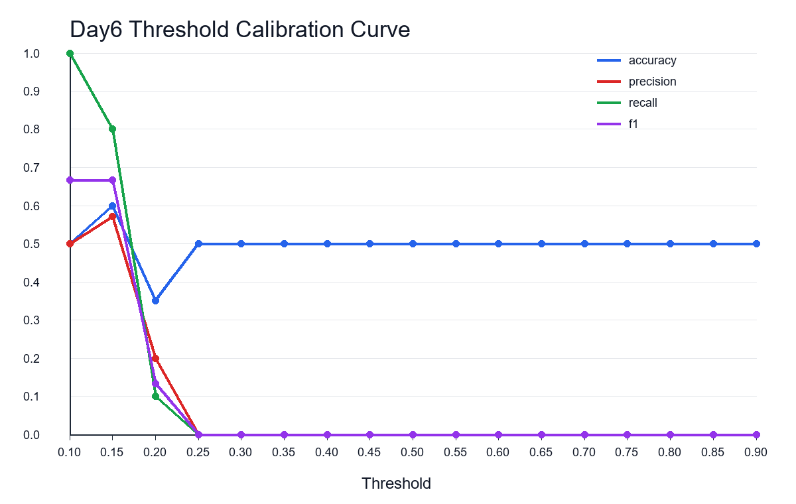

# Day6 Threshold Calibration and Error Analysis

## Day6 Goal

Combine Day4 prediction scores with optional Day5 explanations to calibrate the AI-score threshold, inspect misclassified samples, and identify borderline samples without modifying the detector or source images.

## Inputs

- Day4 predictions: `reports\day4_eval\predictions.csv`
- Day5 explanations: `reports\day5\feature_report.jsonl` (loaded)
- Output directory: `outputs\day6`

## Dataset

- Total usable samples: 20
- Real samples: 10
- AI samples: 10
- Skipped rows: 0

## Recommended Threshold

- Best threshold: `0.15`
- Accuracy: 0.6000
- Precision: 0.5714
- Recall: 0.8000
- F1: 0.6667

The recommended threshold is selected by highest F1-score. When multiple thresholds share the same F1-score, the script chooses the threshold with the most balanced FP/FN counts, then higher accuracy, then the value closest to 0.50 for deterministic stability.
In this run, 2 threshold point(s) shared the winning F1-score; the selected threshold has FP=6 and FN=2.

## Confusion Matrix at Recommended Threshold

| True \ Predicted | AI | Real |
| --- | ---: | ---: |
| AI | 8 | 2 |
| Real | 6 | 4 |

## Error and Borderline Counts

- False positives: 6
- False negatives: 2
- Error cases: 8
- Borderline cases (`abs(ai_score - threshold) <= 0.10`): 20

## Threshold Curve

- Curve file: `outputs\day6\threshold_curve.png`
- The curve plots threshold against accuracy, precision, recall, and F1 to make the tradeoff visible.
- Plot note: matplotlib is not installed; generated threshold_curve.png with Pillow fallback.

## Current System Interpretation

- Bias: at the recommended threshold, the system is more likely to mark real images as AI than to miss AI images.
- Default threshold behavior: 0.50 is too strict for the current score distribution, so many AI images fall below the AI cutoff.
- Threshold strictness: the recommended threshold is below 0.50, which means the current detector scores are generally low and need a looser AI cutoff to recover AI samples.

## Outputs

- `threshold_calibration.csv`: metric scan from threshold 0.10 to 0.90 in 0.05 increments.
- `threshold_curve.png`: visual threshold curve for accuracy, precision, recall, and F1.
- `error_cases.csv`: all samples misclassified at the recommended threshold, with optional Day5 explanations.
- `borderline_cases.csv`: samples within 0.10 of the recommended threshold.
- `day6_summary.md`: this summary report.

## Day7 Suggestions

- Compare Day4 `score` with Day5 `risk_score` to see whether a simple calibrated blend improves separation.
- Review false positives and false negatives separately before changing any core detector weights.
- Add more real-camera, screenshot, compressed, and generated-image samples before locking a threshold.
- Consider reporting an uncertainty band around the threshold instead of forcing binary labels for borderline samples.

_Generated at 2026-05-01T20:46:37+08:00._
